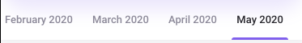

[*<< back to lessons list*](../readme.md)

# Lesson 1 - First app   
## Overview
Задача этого урока потыкать много разных штук, из которых вы потом будете собирать свои приложения. Этот урок получился достаточно объемным, но не переживайте, задания будут не такие уж и сложные, а в остальных урока будет меньше текста :) 

По завершению урока у вас будет приложение состоящее из нескольких экранов, на каждом из которых вы попробуете что-то новое для себя 

## Links
#### Про инициализацию View.
можно инициализировать вьюшки разными способами. Знать нужно как можно больше, пользоваться — удобными
* `ButterKnife` - просмотреть и забыть, он `deprecated` но знать про его существование нужно: https://jakewharton.github.io/butterknife/
* `Kotlin Synthetic` Наверное, самый простой вариант, но с нюансами, почитать можно [тут](https://medium.com/nuances-of-programming/kotlin-android-extensions-%D0%BF%D0%BE%D0%BB%D0%BD%D0%BE%D0%B5-%D1%80%D1%83%D0%BA%D0%BE%D0%B2%D0%BE%D0%B4%D1%81%D1%82%D0%B2%D0%BE-42ad43b029d7). В принципе из-за этих нюансов этот подход деприкейтед, используем следубщий пункт, view binding
* `View Binding` Вариант решающий некоторые проблемы предыдущего, но при этом все еще прост в использовании, тут [интродакшен-видео](https://www.youtube.com/watch?v=W7uujFrljW0) и [документация](https://developer.android.com/topic/libraries/view-binding)
* есть еще `Data Binding`, инструмент посложнее, чаще всего достаточно View Binding. Можно про него почитать в документации или в уроках 18-23 на [этого курса](https://startandroid.ru/ru/courses/architecture-components/27-course/architecture-components/551-urok-18-data-binding-osnovy.html) 
Обобщающая [статья на Хабре](https://habr.com/ru/post/467295/). Там некоторые вещи вам могут быть непонятны, например, `RecyclerView`, мы до этого совсем скоро дойдем, не переживайте :-)  
* еще немного про `ViewBinding`, как писать меньше кода: [Make Android View Binding great with Kotlin](https://proandroiddev.com/make-android-view-binding-great-with-kotlin-b71dd9c87719)   

#### Layouts:   
На данный момент используются 3 основных вида лейаутов:
- [FrameLayout](https://developer.android.com/reference/android/widget/FrameLayout)   
- [**Linear Layout**](https://developer.android.com/guide/topics/ui/layout/linear) 
- **ConstraintLayout** На данный момент это основной инструмент для создания разметки экранов. Ознакомиться можно с ним в [документации](https://developer.android.com/reference/androidx/constraintlayout/widget/ConstraintLayout) или в уроках от startandroid [здесь(уроки 180-183)](https://startandroid.ru/ru/uroki/vse-uroki-spiskom/489-urok-180-constraintlayout-osnovy.html) 

#### Отображение изображений 
- Есть 2 основные библиотеки которые помогают работать с изображниями: [picasso](https://square.github.io/picasso/) и [glide](https://github.com/bumptech/glide). Различий практически в них нет, разве что Пикассо не дружит с svg форматом. 
- Если нужно изменить форму изображения, то [вот](https://github.com/wasabeef/picasso-transformations)
- [урок про пикассо](http://developer.alexanderklimov.ru/android/library/picasso.php)
- погуглить про `ShapeableImageView`, в частности помогает отображать изображения круглыми

#### `ViewPager` и `TabLayout`
- Документация: [User Guide](https://developer.android.com/guide/navigation/navigation-swipe-view-2) и [Code Sample](https://github.com/android/views-widgets-samples/tree/master/ViewPager2)
- на хабре про [`ViewPager2`](https://habr.com/ru/company/surfstudio/blog/461873/)
- про `TabLayout` [тут](https://material.io/develop/android/components/tabs)

#### разное
- [Toasts overview](https://developer.android.com/guide/topics/ui/notifiers/toasts)
- [Snackbars](https://material.io/components/snackbars)
- [Диалоговые окна](https://developer.android.com/guide/topics/ui/dialogs?hl=ru)

## Tasks
Приложение будет состоять из нескольких экранов. 
Главный экран - экран навигации, с которого можно будет попасть на все остальные экраны.

Все тексты в приложении - на английском, локализация - для украинского языка.
#### 0. Перед тем как начать
- разберитесь чем отличаются wrap_content / match parent / 0dp у вьюшек в размерах высоты-ширины. 
- 

#### 1. Главный экран 
На нем всё будет просто: тулбар и список кнопок  для перехода к другим экранам. 
- В тулбаре должно отображаться название приложения
- под ним расположены кнопки для перехода, так как мы учитываем что экран устройства может быть маленьким, а количество кнопок - достаточно большим, то кнопки размещаем в ScrollView
- кнопка - стандартной высоты, ширина - на весь экран с отступами от краев в `20dp`(задан в ресурсах)
- кнопки создать сразу на все задания этого урока. При создании экрана сделать все кнопки `enabled = false`, gо мере выполнения заданий делать кнопки доступными. 
Научиться менять цвет кнопки в зависимости от того доступна ли она или нет (делается через ресурсы). Текст на кнопке - интуитивно понятный, строка в ресурсах. 
- инициализировать вьюшки через `findViewById()`
  
#### 2. Экран Калькулятора
Подразумевается, что у вас код калькулятора остался с курса по CS и вам не нужно будет писать заново логику вычислений

2.1. Внешний вид: 
- `TextView` в котором отображается ввод  
- кнопки цифр `0..9`, кнопки действий `+ - * /`
- при клике на кнопки, соответствующий символ появляется в поле ввода   
- кнопка `посчитать`, при клике на которую берется текст из поля ввода, проводятся вычислений, текст в поле ввода заменяется на результат вычислений или на текст ошибки
- кнопка `очистить` которая стирает весь текст
- тут и далее в курсе: все вью инициализировть через [ViewBinding](https://developer.android.com/topic/libraries/view-binding), (**не** через `Butterknife` и **не** `findViewById()`)

2.2. Калькулятор должен быть удобен в использовании, подразумевается, что калькулятор хорошо отображается и в горизонтальной, и в вертикальной ориентации экрана. 
2.3. Добавить поле вывода, убрать кнопку подсчета результата, результат считать в `TextChangedListener` и выводить в поле вывода
2.4. Не забудьте:
- некоторые вещи нужно будет поменять в коде калькулятора, например, если вы логировали какие-то действия через System.out.println(), то в андроиде так не выйдет
- пользователю должно быть понятно что происходит у вас в приложении. Некоторые действия невозможны (он не может ввести 2 и более знаков `+`, например) 
- если происходит ошибка, она должна быть показана пользователю 

#### 3. Отображаем картинки
3.1. Начало:
- Сделать массив изображений из папки ресурсов
- на экране должна быть кнопка и `ImageView`. По клику на кнопку из массива берется изображение и отображается в `ImageView`
 
3.2. изменить массив входных данных, на массив изображений из разных источников (ресурсы, интернет, папка assets) 

3.3. Добавить на экран дропдаун, в котором добавить несколько (не менее 5) вариантов трансформации изображений (почитать
 про это можно выше). Тепе4рь при клике на кнопку, изображение загружается во вьюшку с примененной трансформацией 

3.4. На главном экране добавить "аватарку" пользователя: взять любое изображение из ресурсов и с помощью `ShapeableImageView` отображать круглым в углу экрана 

3.5. Пикассо/Глайд буферизирует изображения при отображении. Научиться буферизировать картинку без отображения: теперь все картинки которые берутся из интернета, должны прогружаться не при выборе, а при старте экрана. 
Не забывайте, скачивание изображений занимает какое-то время, покажите `ProgressBar` пока не прогрузятся изображения.  

3.6. Научиться загружать SVG картинки из интернета и динамически менять их цвет на заданный в приложении:
- добавляем еще один раздел на главном экране
- экран состоит из: вьюшки для изображения и вьюшки для выбора цвета (например, цветные кружочки)
- по дефолту загружено изображение без применения цветов, по выборе цвета изображение перекрашивается   

#### 4. Играемся с ConstraintLayout    
Если вдруг еще не прочитали, то прочитайте [ссылки выше](lesson_1.md#Layouts:)

Задача сделать что-то вроде такого:

- вместо крестиков вставить свои изображения (само собой - svg)
- элементы с Title1 и Title2 - квадратные. высоту других элементов можно менять в зависимости от размеров экрана.
- лучше сделать более-менее привязанный к контенту текст/изображения, представьте что это какое-то меню 
- like-a-pro mode: экран должен адекватно отображаться на экранах всех размеров, без прокручивания.

#### 5. RecyclerView
Знакомимся со списками, самый популярный интсрумент для их создания - RecyclerView.

Можно о нем почитать в [документации гугла](https://developer.android.com/guide/topics/ui/layout/recyclerview) или в [уроке](http://developer.alexanderklimov.ru/android/views/recyclerview-kot.php)  

Задание - изучаем котиков: сделать список пород котов. с фотографиями 
- в папке `assets` создаем файл в котором пишем названия породы котов и линку на фотографию кота этой породы
- читаем данные из файла и создаем `RecyclerView` с породами котов. Каждый айтем занимает всю ширину экрана (кроме марджинов слева-справа по `20dp`), в нем маленькая фотография кота, название породы
- вверху экрана добавляем кнопку, при клике на которую наш ресайклер с горизонтальными айтемами превращается в ресайклер с `GridLayout` и двумя колонками. Теперь наши айтемы большие и в них поместится большая фотография кота :)   
- при повторном клике меняется обратно

#### 6. `ViewPager`
На данный момент актуальный - `ViewPager2`. На всякий случай нужно знать что есть и просто `ViewPager`, почитать можно [тут](https://startandroid.ru/ru/uroki/vse-uroki-spiskom/228-urok-125-viewpager.html), наверняка, его еще кто-то использует. Но мы будем использовать `ViewPager2`
перед выполнением задания почитать ссылки выше[lesson1](lesson_1.md#6-viewpager--tablayout) 

Задание:
- сделать ViewPager с 3 вкладками, поиграться с `TabLayout`, посмотреть что с ним можно сделать. 
- разобраться, как добавлять вкладку динамически
- сделать "бесконечный" вьюпейджер

##### 6.1 Связываем `TabLayout` и `RecyclerView`
Задача - сделать что-то вроде вот такого `TabLayout`: 

часть 1:
- сгенерировать(скопировать/скачать) любые данные в которых есть указание месяца/года. Это могут быть даты транзакций или месяцы выхода каких-нибудь фильмов. Главное условие - данных должно быть достаточно для выполнения задания
- на экране расположить `TabLayout`, под ним `RecyclerView`
- вверху экрана расположить `TabLayout` (должна быть разрешена прокрутка), в нем будут находиться "фильтры": месяц и год, добавляем динамически в зависимости от данных 
- в `RecyclerView` отображаются элементы с данными
- при прокручивании `RecyclerView` должен изменяться выделенный "фильтр" `TabLayout`, и наоборот, при клике на "фильтр", ресайклер должен скролиться в нужную позицию

часть 2:
- перед каждым месяцем в элементах `RecyclerView` должна идти вьюшка-тайтл с месяцем/годом, при нажатии на "фильтр" проматывать ресайклер к этой вью-тайтлу  

#### 7. Анимируем с Lottie
Есть классный способ отображения анимаций [Lottie](https://airbnb.design/lottie/)

Это задание - на креатив :) 
- почитать что-как-почему в Lottie
- дальше - поиграться на ваше усмотрение с анимациями: найти которая вам нравится([можно тут](https://lottiefiles.com/)), запустить ее, 
можно по клике на кнопку что-нибуддь с анимацией делать. в общем, можно делать здесь что угодно, задача - потыкать возможности Lottie
 
#### 8. Добавляем цвет фона через меню
на главный экран добавить меню в верхний правый угол в котором спрятать выбор цвета фона 
для всех экранов. Реализация - на ваше усмотрение,можно поставить несколько предустановленных
цветов, можно попробовать поиграться и сделать что-то интересное, главное что бы 
пользователь мог поменять цвет фона. Можно заодно поменять и цвет статусбара, тулбара, кнопок и тп

[*<< back to lessons list*](../readme.md)
      
