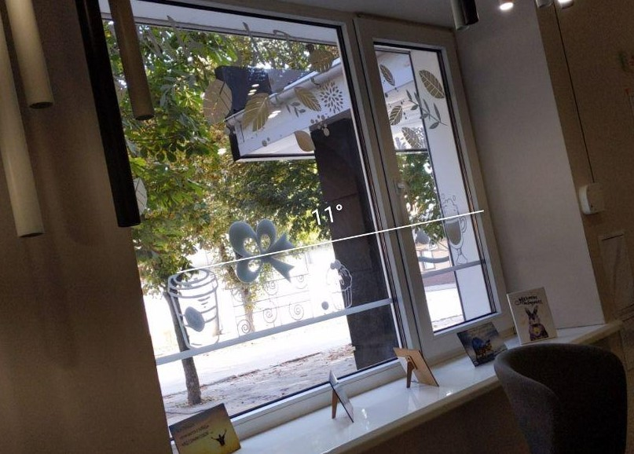

[*<< back to lessons list*](../readme.md)

# Lesson 8 - Permissions, Camera
## Overview
Недавно на Хабре была [статья](https://habr.com/ru/company/vdsina/blog/509934/), про то что андроид - достаточно безопасная платформа. Один из способов защиты пользователей - это запрос разрешений на получение чувствительных данных от устройства. Сегодня поговори про Permissions, а заодно и поработаем с камерой.  

## To read
- читаем про [Permissions](https://developer.android.com/guide/topics/permissions/overview)  
- [Permissions: material guideline](https://material.io/design/platform-guidance/android-permissions.html#usage)
- [Camera X](https://developer.android.com/training/camerax)

##### разное:
про сканирование QR кода:
- [QR Scanning using CameraX((with Zxing library))](https://medium.com/@msasikanth/qr-scanning-using-camerax-4757ed3687f8)
- [Building QR code scanner for Android using Firebase ML Kit and CameraX](https://www.natigbabayev.com/2019-07-13/building-qr-code-scanner-for-android-using-firebase-ml-kit-and-camerax)
- [RecyclerView.ItemDecoration: используем по максимуму](https://habr.com/ru/company/surfstudio/blog/513038/)

## Задание
### Часть 1: делаем телефонную книгу
Если есть время и желание, можно сделать красивую и функциональную 
телефонную книгу, включаем креатив :). Если нет - то делаем минимум:
- при старте приложения запрашиваем доступ к списку контактов, продумать что делать если пользователь отказал
- контакты отображаем в алфавитном порядке, в `recyclerview`.
- при клике на контакт открываем активити для телефонного звонка 
- добавить в RV заголовок с первой буквой перед списком контактов на эту букву

### Часть 2: разбираемся с камерой
Приложение на один экран, но с двумя режимами. при запуске - просим разрешение на доступ к камере, на весь экран появляется видоискатель камеры 

Первый режим - камера для людей которые любят заваливать горизонт: по средине экрана находится линия, которая показывает на сколько у пользователя завален горизонт. При фотографировании аккуратно складываем фотографии в папочку. выглядит это примерно вот так:
 

Второй режим - режим распознавания QR кода, тут все просто: распознали, отобразили результат, должна быть кнопка "скопировать" результат